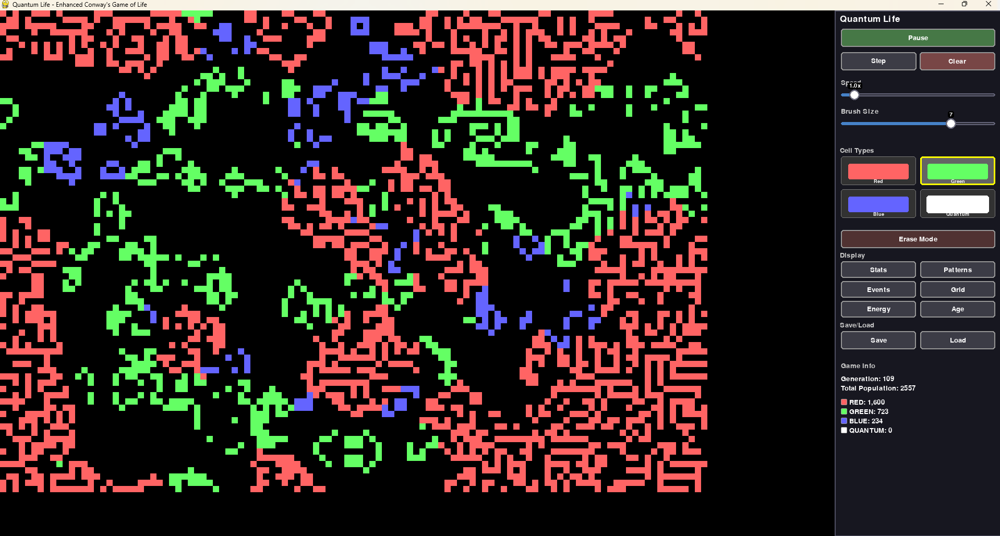

# Quantum Life - Enhanced Conway's Game of Life

An advanced cellular automaton simulation featuring multiple species, quantum effects, random events, and complex ecosystem interactions.



## Features

### Multi-Species Cellular Automaton
- **Red Cells**: Aggressive species requiring more neighbors to survive
- **Green Cells**: Cooperative species surviving with fewer neighbors  
- **Blue Cells**: Balanced species following classic Conway rules
- **Quantum Cells**: Special species with tunneling and phase evolution

### Interactive Gameplay
- Real-time simulation with adjustable speed
- Multiple drawing tools and brush sizes
- Pattern library with classic Conway patterns
- Save/load functionality for game states

### Random Events System
- **Meteor Impact**: Creates craters and destroys cells
- **Energy Wave**: Boosts cell energy across areas
- **Mutation Burst**: Increases mutation rates temporarily
- **Quantum Storm**: Converts cells to quantum state
- **Species Migration**: Moves species across the grid
- **Cosmic Radiation**: Causes random mutations
- **Temporal Rift**: Freezes time in affected areas
- **Ecosystem Bloom**: Creates diverse cellular environments

### Advanced Analytics
- Population tracking and history
- Entropy and diversity calculations
- Fractal dimension estimation
- Birth/death rate analysis
- Stability and chaos detection
- Real-time statistics display

### Visual Effects
- Particle systems for births and deaths
- Glow effects for high-energy cells
- Quantum phase-based color cycling
- Trail effects for moving particles
- Event-specific visual feedback

## Installation

### Requirements
- Python 3.8+
- pygame 2.5.0+
- numpy 1.24.0+
- matplotlib 3.7.0+

### Setup
1. Clone the repository
2. Install dependencies:
```bash
pip install -r requirements.txt
```
3. Run the game:
```bash
python main.py
```

## Controls

- **SPACE** - Play/Pause simulation
- **S** - Step one generation
- **C** - Clear grid
- **H** - Toggle UI visibility
- **1-4** - Select cell type (Red/Green/Blue/Quantum)
- **0** - Erase mode
- **M** - Trigger random meteor event
- **Mouse** - Draw cells with selected brush
- **Right Click** - Place selected pattern

## Game Mechanics

### Species Interactions
Each species has unique survival rules and can interact with others through:
- **Symbiosis**: Some species cooperate for mutual benefit
- **Competition**: Species compete for resources
- **Quantum Enhancement**: Quantum cells boost nearby species

### Energy System
Cells consume and generate energy through:
- Interaction bonuses from neighboring species
- Energy decay over time
- Event-based energy modifications

### Pattern System
Includes classic Conway patterns organized by category:
- Still Lifes (Block, Beehive, Loaf)
- Oscillators (Blinker, Toad, Pulsar)
- Spaceships (Glider, Lightweight Spaceship)
- Methuselahs (R-pentomino, Diehard)
- Guns (Gosper Glider Gun)

## Technical Implementation

- **Modular Architecture**: Separated concerns across multiple modules
- **Responsive Design**: Adapts to different screen sizes
- **Performance Optimized**: Efficient algorithms for large simulations
- **Extensible Events**: Easy to add new event types
- **Statistical Analysis**: Advanced mathematical modeling